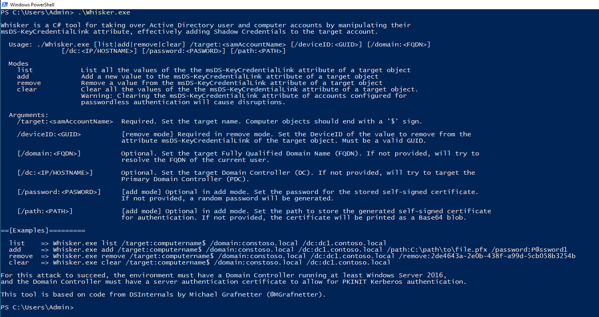

# Whisker (Türkçe)

> Bu depo, [eladshamir/Whisker](https://github.com/eladshamir/Whisker) projesinin Türkçe yorum satırları ve konsol mesajları içeren bir uyarlamasıdır. Orijinal proje **MIT Lisansı** ile yayınlanmıştır; bu uyarlama da aynı lisans altında, orijinal telif bildirimi korunarak sunulmaktadır. Komut satırı arayüzü (`/target`, `/domain`, `/dc` gibi parametre adları) uyumluluk için İngilizce bırakılmıştır.

Whisker, hedef Active Directory kullanıcı ve bilgisayar hesaplarının `msDS-KeyCredentialLink` özniteliğini manipüle ederek ele geçirilmesini sağlayan bir C# aracıdır - bu işlem, hedef hesaba etkin biçimde bir "Shadow Credential" (gölge kimlik bilgisi) eklenmesi anlamına gelir.

Bu araç, Michael Grafnetter'in ([@MGrafnetter](https://twitter.com/MGrafnetter)) [DSInternals](https://github.com/MichaelGrafnetter/DSInternals) projesindeki koda dayanmaktadır.

Bu saldırının başarılı olabilmesi için ortamda en az Windows Server 2016 çalıştıran bir Domain Controller bulunmalı ve bu Domain Controller'ın, PKINIT Kerberos kimlik doğrulamasına izin veren bir sunucu kimlik doğrulama sertifikası olmalıdır.

Daha fazla bilgi için: [Shadow Credentials: Abusing Key Trust Account Mapping for Takeover](https://posts.specterops.io/shadow-credentials-abusing-key-trust-account-mapping-for-takeover-8ee1a53566ab)

## Kullanım

### Hedef nesnenin msDS-KeyCredentialLink özniteliğine yeni bir değer ekleme:

 - `/target:<samAccountName>`: Zorunlu. Hedef nesnenin adını belirtir. Bilgisayar nesneleri '$' ile bitmelidir.

 - `/domain:<FQDN>`: İsteğe bağlı. Hedefin tam nitelikli alan adını (FQDN) belirtir. Verilmezse mevcut kullanıcının FQDN'si çözümlenmeye çalışılır.

 - `/dc:<IP/HOSTNAME>`: İsteğe bağlı. Hedef Domain Controller'ı (DC) belirtir. Verilmezse Primary Domain Controller (PDC) hedeflenmeye çalışılır.

 - `/path:<YOL>`: İsteğe bağlı. Kimlik doğrulama için üretilen kendinden imzalı (self-signed) sertifikanın kaydedileceği dosya yolunu belirtir. Verilmezse sertifika Base64 blob olarak ekrana yazdırılır.

 - `/password:<PAROLA>`: İsteğe bağlı. Saklanan kendinden imzalı sertifikanın parolasını belirtir. Verilmezse rastgele bir parola üretilir.

Örnek: `Whisker.exe add /target:computername$ /domain:constoso.local /dc:dc1.contoso.local /path:C:\yol\dosya.pfx /password:P@ssword1`

### Hedef nesnenin msDS-KeyCredentialLink özniteliğinden bir değer kaldırma:

 - `/target:<samAccountName>`: Zorunlu. Hedef nesnenin adını belirtir. Bilgisayar nesneleri '$' ile bitmelidir.

 - `/deviceID:<GUID>`: Zorunlu. Hedef nesnenin `msDS-KeyCredentialLink` özniteliğinden kaldırılacak değerin DeviceID'sini belirtir. Geçerli bir GUID olmalıdır.

 - `/domain:<FQDN>`: İsteğe bağlı. Hedefin tam nitelikli alan adını (FQDN) belirtir. Verilmezse mevcut kullanıcının FQDN'si çözümlenmeye çalışılır.

 - `/dc:<IP/HOSTNAME>`: İsteğe bağlı. Hedef Domain Controller'ı (DC) belirtir. Verilmezse Primary Domain Controller (PDC) hedeflenmeye çalışılır.

Örnek: `Whisker.exe remove /target:computername$ /domain:constoso.local /dc:dc1.contoso.local /deviceid:2de4643a-2e0b-438f-a99d-5cb058b3254b`

### Hedef nesnenin msDS-KeyCredentialLink özniteliğindeki tüm değerleri temizleme:

 - `/target:<samAccountName>`: Zorunlu. Hedef nesnenin adını belirtir. Bilgisayar nesneleri '$' ile bitmelidir.

 - `/domain:<FQDN>`: İsteğe bağlı. Hedefin tam nitelikli alan adını (FQDN) belirtir. Verilmezse mevcut kullanıcının FQDN'si çözümlenmeye çalışılır.

 - `/dc:<IP/HOSTNAME>`: İsteğe bağlı. Hedef Domain Controller'ı (DC) belirtir. Verilmezse Primary Domain Controller (PDC) hedeflenmeye çalışılır.

Örnek: `Whisker.exe clear /target:computername$ /domain:constoso.local /dc:dc1.contoso.local`

⚠️ *Uyarı: Parolasız kimlik doğrulama (passwordless authentication) için yapılandırılmış hesaplarda msDS-KeyCredentialLink özniteliğinin temizlenmesi aksaklıklara yol açar.*

### Hedef nesnenin msDS-KeyCredentialLink özniteliğindeki tüm değerleri listeleme:

 - `/target:<samAccountName>`: Zorunlu. Hedef nesnenin adını belirtir. Bilgisayar nesneleri '$' ile bitmelidir.

 - `/domain:<FQDN>`: İsteğe bağlı. Hedefin tam nitelikli alan adını (FQDN) belirtir. Verilmezse mevcut kullanıcının FQDN'si çözümlenmeye çalışılır.

 - `/dc:<IP/HOSTNAME>`: İsteğe bağlı. Hedef Domain Controller'ı (DC) belirtir. Verilmezse Primary Domain Controller (PDC) hedeflenmeye çalışılır.

Örnek: `Whisker.exe list /target:computername$ /domain:constoso.local /dc:dc1.contoso.local`

## Kaynaklar
 - https://github.com/MichaelGrafnetter/DSInternals
 - https://posts.specterops.io/shadow-credentials-abusing-key-trust-account-mapping-for-takeover-8ee1a53566ab
 - Orijinal proje: https://github.com/eladshamir/Whisker

## Not

`Whisker/DSInternals.Common/` klasöründeki dosyalar, Michael Grafnetter'in DSInternals kütüphanesinden vendörlenmiş (projeye gömülmüş) yardımcı sınıflardır ve orijinal İngilizce haliyle bırakılmıştır - bu dosyalar Whisker'ın kendi mantığı değil, üçüncü taraf bir bağımlılıktır.
